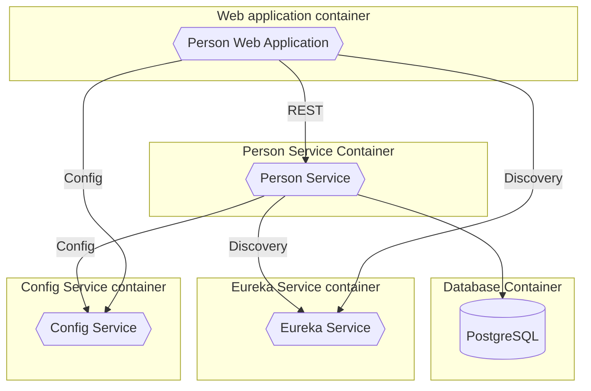

## Introduction

In this article, we will examine a sample application that I developed and use for my courses on Microservices architecture. The application is a simple system for managing people's data, allowing you to add, modify, and view information about each person. In the future, it could be extended to include more complex features, such as managing relationships between people, exchanging messages, or integrating with other systems.

The application consists of two main microservices:

- **Person Service**: manages information about people. It exposes a REST API to create, read, update, and delete people's information. It uses the Spring Boot framework and communicates with a PostgreSQL database to store people's data.
- **Person Web Application**: is a web application that allows users to view and manage people's information. It uses the Spring Boot framework to create the user interface and communicates with the *Person Service* through REST calls, using [Spring Cloud Circuit Breaker](https://spring.io/projects/spring-cloud-circuitbreaker) (with Resilience4J) to handle potential communication errors.


In addition to these, there are other infrastructure services:

- **Eureka Service**: a discovery service that allows microservices to register and discover other services.
- **Config Service**: manages the centralized configuration of the microservices.

<div class="max-w-3/4 m-auto">



</div>

## Running the Application

The source code for the application is available on [GitHub](https://github.com/benfante-teaching/microservices-demo).

To build it, you need to have the following installed:

- Java 24+: for example, from [Adoptium](https://adoptium.net/temurin/releases/?version=24), but any distribution should work. I usually use [Liberica](https://bell-sw.com/pages/downloads/#jdk-24).
- [Docker](https://www.docker.com): also required to run the tests, which are based on [Testcontainers](https://testcontainers.com).

Assuming you have the above installed and ready, the following steps are sufficient to run the application ([git](https://git-scm.com) is already installed, right? 😉):

1. Clone the repository:

    ```bash
    git clone https://github.com/benfante-teaching/microservices-demo.git
    ```

2. Navigate to the project folder:

    ```bash
    cd microservices-demo
    ```

3. Build the application and its Docker images:

    ```bash
    ./mvnw clean verify
    ```

4. Run the application with Docker Compose:

    ```bash
    docker compose up
    ```

5. Open your browser and navigate to [http://localhost:8082](http://localhost:8082) to access the web application.

Other available elements include (remember, this is a teaching environment: in a production environment, these would not be exposed or would at least be adequately protected!):

- **Swagger UI** for the People Service: [http://localhost:8081/swagger-ui.html](http://localhost:8081/swagger-ui.html)
- **Eureka Service Dashboard**: [http://localhost:8761](http://localhost:8761)
- **H2 Console** to access the PostgreSQL database: [http://localhost:8081/h2-console](http://localhost:8081/h2-console). The parameters are as follows:
  - Saved Settings: `Generic PostgreSQL`
  - Driver Class: `org.postgresql.Driver`
  - JDBC URL: `jdbc:postgresql://people-postgres/people`
  - User Name: `people`
  - Password: `people`
- **PostgreSQL Database**: you can access it directly using [pgAdmin](https://www.pgadmin.org) or another SQL client (e.g., [DBeaver](https://dbeaver.io)). The credentials are as follows:
  - Host: `localhost`
  - Port: `54321`
  - Database: `people`
  - User: `people`
  - Password: `people`

## Developing Individual Microservices

The projects are organized as Maven modules, so you can develop individual microservices as standalone Maven projects.

For example, to develop the *Person Service*, you can navigate to the `person-service` folder and use standard Maven commands:

```bash
cd person-service
./mvnw clean verify
```

To run the service during development, you can use:

```bash
./mvnw spring-boot:run
```

This will run the service on port 8080, and all its dependencies (People Web Application, Config Server, Eureka Server, etc.) will automatically run inside Docker containers, thanks to Spring Boot's Docker Compose support.

## Conclusion

In this article, we examined a sample application that illustrates the Microservices architecture. We looked at how the application is structured, its main components, and how to run it locally. We also explored how to develop individual microservices using Maven and Spring Boot.

I hope this example helps you better understand the Microservices architecture and how to implement it in a real application. If you have any questions or comments, feel free to reach out!

In the future, the application will be extended to include examples on other topics I plan to cover in my upcoming courses, such as:

- **Spring Cloud Gateway**: to manage calls between microservices and the web application
- **Spring Cloud Stream**: to handle communication between microservices via events
- Deployment on Kubernetes
- Authentication and authorization with OAuth2
- Monitoring and tracing calls between microservices
- ...anything else? Let me know in the comments!

## Useful Resources

- [Project repository](https://github.com/benfante-teaching/microservices-demo)
- [Spring Boot](https://spring.io/projects/spring-boot)
- [Spring Cloud](https://spring.io/projects/spring-cloud)
- [Spring Cloud Circuit Breaker](https://spring.io/projects/spring-cloud-circuitbreaker)
- [Spring Cloud Config](https://spring.io/projects/spring-cloud-config)
- [Spring Cloud Commons](https://docs.spring.io/spring-cloud-commons/reference/)
- [Spring Boot Docker Compose Support](https://docs.spring.io/spring-boot/reference/features/dev-services.html#features.dev-services.docker-compose)
- [Spring Boot Database Initialization](https://docs.spring.io/spring-boot/how-to/data-initialization.html)
- [Testcontainers](https://testcontainers.com)
