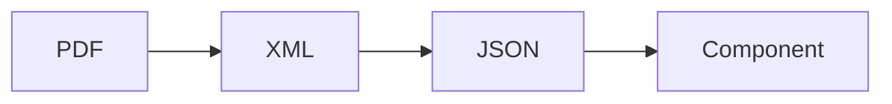

## Introduction

On my personal website, I have always had a section where my resume could be viewed and downloaded as a PDF.

The information in my resume was defined within an XML file, using the format provided by the [XML Résumé Library](http://xmlresume.sourceforge.net/), which was then transformed into various formats, including HTML and PDF, to be embedded in the website pages. However, this library is no longer maintained and uses technologies that are difficult to integrate into modern web frameworks.

Additionally, for several years now, my clients have often requested my resume in the [Europass](https://europass.europa.eu) format, a standardized format for resumes in Europe. It has become increasingly tedious and complicated to keep my Europass resume and the one on my website aligned.

With the redesign of my website using [Astro](https://astro.build/), I decided to explore the possibility of generating the resume page directly using Europass data.

## The Europass Format

The Europass format is a standardized format for resumes in Europe, allowing skills, qualifications, and professional experiences to be described in a uniform and understandable way across all European Union countries.

On the [Europass website](https://europass.europa.eu), you can create a profile, input your resume information, and download the resume in PDF format.

For a time, it seemed possible to download your resume data in XML format and use web services to access it, but this no longer appears to be an option (if anyone knows how, let me know!).

Currently, you can download the resume in PDF format (or share a publicly accessible link). Within the PDF, there is an attachment (yes, the PDF format supports attachments) containing the resume in XML format, which was likely used to generate the PDF.

If you're interested in the structure of the XML resume format, [this document](https://europass.europa.eu/system/files/2020-08/ECV_Schema_Documentation_v3.0.0_20200602.pdf) provides the XML schema documentation.

## The Data Extraction Process

After downloading the resume in PDF format (it is also possible to automate the download, though I haven't done so), you need to extract the XML file contained within. Since the XML format is quite cumbersome to use within a JavaScript framework, I decided to convert it to JSON format.

The data extraction process is as follows:



### Extracting the XML File

To extract the XML file contained within the PDF, I used the `pdfdetach` command from the [poppler-utils](https://github.com/elswork/poppler-utils) package:

```bash
pdfdetach -savefile attachment.xml -o cv.xml cv.pdf
```

To install `poppler-utils` on Debian and derivatives:

```bash
sudo apt-get install poppler-utils
```

Equivalent packages should be available for other Linux distributions.

If you're not using Linux, you can use poppler-utils via Docker:

```bash
docker run -it --rm -v $(pwd):/data elswork/poppler-utils \
pdfdetach -savefile attachment.xml -o cv.xml cv.pdf
```

### Converting to JSON Format

There are various ways to convert an XML file to JSON format, each producing slightly different results. I used the [convert-xml-to-json](https://github.com/Zamiell/convert-xml-to-json) package, which, while simple and not very flexible, does the job well.

```bash
npx convert-xml-to-json cv.xml cv.json
```

The result is a JSON file containing all the Europass resume data, converting each XML tag into a JSON field.

For example, starting from this XML fragment:

```xml title="cv.xml" collapse={4-9, 13-24}
<EmployerHistory>
    <hr:OrganizationName>D2P Solution S.R.L.</hr:OrganizationName>
    <OrganizationContact>
        <Communication>
            <Address>
                <oa:CityName>Rome</oa:CityName>
                <CountryCode>it</CountryCode>
            </Address>
        </Communication>
    </OrganizationContact>
    <hr:IndustryCode>P</hr:IndustryCode>
    <PositionHistory>
        <PositionTitle typeCode="URI" languageID="http://data.europa.eu/esco/occupation/81f8d141-3f67-4fb0-a349-db0147ef7b3a">
            Instructor in professional qualification courses
        </PositionTitle>
        <eures:EmploymentPeriod>
            <eures:StartDate>
                <hr:FormattedDateTime>2023-01</hr:FormattedDateTime>
            </eures:StartDate>
            <hr:CurrentIndicator>true</hr:CurrentIndicator>
        </eures:EmploymentPeriod>
        <oa:Description>&lt;p&gt;Training on the following topics: SQL, Java, JDBC, JPA/Hibernate, Java EE, Servlets, Spring Framework, Spring MVC, Maven, HTML, CSS, JavaScript, Angular, Git, Test Driven Development, Microservices.&lt;/p&gt;</oa:Description>
        <City>Rome</City>
        <Country>it</Country>
    </PositionHistory>
</EmployerHistory>
```

You get this JSON:

```json title="cv.json" collapse={7-18, 22-49}
"EmploymentHistory": [
    {
        "EmployerHistory": [
        {
            "hr:OrganizationName": ["D2P Solution S.R.L."],
            "OrganizationContact": [
                {
                    "Communication": [
                        {
                            "Address": [
                                {
                                    "oa:CityName": ["Rome"],
                                    "CountryCode": ["it"]
                                }
                            ]
                        }
                    ]
                }
            ],
            "hr:IndustryCode": ["P"],
            "PositionHistory": [
                {
                    "PositionTitle": [
                        {
                            "_": "Instructor in professional qualification courses",
                            "$": {
                                "typeCode": "URI",
                                "languageID": "http://data.europa.eu/esco/occupation/81f8d141-3f67-4fb0-a349-db0147ef7b3a"
                            }
                        }
                    ],
                    "eures:EmploymentPeriod": [
                        {
                            "eures:StartDate": [
                                {
                                    "hr:FormattedDateTime": [
                                        "2023-01"
                                    ]
                                }
                            ],
                            "hr:CurrentIndicator": ["true"]
                        }
                    ],
                    "oa:Description": [
                        "<p>Training on the following topics: SQL, Java, JDBC, JPA/Hibernate, Java EE, Servlets, Spring Framework, Spring MVC, Maven, HTML, CSS, JavaScript, Angular, Git, Test Driven Development, Microservices.</p>"
                    ],
                    "City": ["Rome"],
                    "Country": ["it"]
                }
            ]
        }
        ]
    }
]
```

## Automating the Data Extraction Process

Although these operations are relatively simple to perform manually, I decided to automate them by defining NPM scripts that could be run more easily and even automatically during the website build process.

Unfortunately, there is no NPM package that provides a command to extract attachments from PDF files. I had to add a TypeScript script that uses the [pdf-lib](https://pdf-lib.js.org/) library to perform this task.

I added this library to the project:

```bash
pnpm add -D pdf-lib
```

Using the description [here](https://github.com/Hopding/pdf-lib/issues/534) as a starting point, the result was as follows:

```typescript title="extract-pdf-attachment.ts" collapse={4-11, 15-31, 35-44}
import fs from "fs";
import {
    PDFDocument,
    PDFName,
    PDFDict,
    PDFArray,
    PDFHexString,
    PDFString,
    PDFStream,
    decodePDFRawStream,
    PDFRawStream,
} from "pdf-lib";

const extractRawAttachments = (pdfDoc: PDFDocument) => {
    if (!pdfDoc.catalog.has(PDFName.of("Names"))) return [];
    const Names = pdfDoc.catalog.lookup(PDFName.of("Names"), PDFDict);

    if (!Names.has(PDFName.of("EmbeddedFiles"))) return [];
    const EmbeddedFiles = Names.lookup(PDFName.of("EmbeddedFiles"), PDFDict);

    if (!EmbeddedFiles.has(PDFName.of("Names"))) return [];
    const EFNames = EmbeddedFiles.lookup(PDFName.of("Names"), PDFArray);

    const rawAttachments = [];
    for (let idx = 0, len = EFNames.size(); idx < len; idx += 2) {
        const fileName = EFNames.lookup(idx) as PDFHexString | PDFString;
        const fileSpec = EFNames.lookup(idx + 1, PDFDict);
        rawAttachments.push({ fileName, fileSpec });
    }

    return rawAttachments;
};

const extractAttachments = (pdfDoc: PDFDocument) => {
    const rawAttachments = extractRawAttachments(pdfDoc);
    return rawAttachments.map(({ fileName, fileSpec }) => {
        const stream = fileSpec
            .lookup(PDFName.of("EF"), PDFDict)
            .lookup(PDFName.of("F"), PDFStream) as PDFRawStream;
        return {
            name: fileName.decodeText(),
            data: decodePDFRawStream(stream).decode(),
        };
    });
};

(async () => {
    const args = process.argv.slice(2);
    if (args.length !== 3) {
        console.log(
            "Usage: tsx extract-pdf-attachment.ts <pdfFile> <attachmentName> <destinationFile>"
        );
        process.exit(1);
    }

    const pdfFile = args[0];
    const attachmentName = args[1];
    const destinationFile = args[2];

    const pdf = fs.readFileSync(pdfFile);
    const pdfDoc = await PDFDocument.load(pdf.toString("base64"));

    const attachments = extractAttachments(pdfDoc);

    const attachment = attachments.find(
        (attachment) => attachment.name === attachmentName
    )!;
    fs.writeFileSync(destinationFile, attachment.data);
    console.log(`Attachment file written to ${destinationFile}`);
})();
```

You can now extract the XML attachment from a PDF file:

```bash
pnpx tsx extract-pdf-attachment.ts cv.pdf attachment.xml cv.xml
```

First, ensure you have all the necessary dependencies:

```bash
pnpm add -D tsx convert-xml-to-json pdf-lib
```

You can now define scripts in `package.json` to automate the entire process.

```json title="package.json" collapse={2-5}
"scripts": {
    "dev": "astro dev",
    "build": "astro build",
    "preview": "astro preview",
    "astro": "astro",
    "extract-cv:pdf-to-xml": "tsx scripts/extract-pdf-attachment.ts public/docs/cv.pdf attachment.xml src/libs/cv/cv.xml",
    "extract-cv:xml-to-json": "convert-xml-to-json src/libs/cv/cv.xml src/libs/cv/cv.json",
    "extract-cv": "npm run extract-cv:pdf-to-xml && npm run extract-cv:xml-to-json"
},
```

The entire data extraction process can now be executed with a single command:

```bash
pnpm run extract-cv
```

## Creating the Component

Once you have the JSON file containing the resume data, you can use it within an Astro component or page to display the information.

For example, this is what I currently use for the resume page on my website:

```js title="src/pages/cv.astro" collapse={2-5, 7-70, 72-83, 96-121, 123-137}
---
import Layout from '@layouts/Layout.astro';

import * as m from "@paraglide/messages"

import cv  from '@libs/cv/cv.json'
import { Icon } from 'astro-icon/components';

const title = 'Curriculum Vitae';
const description = 'My resume';

const employmentPeriod = (period: any) => {
    if (period) {
        const startDate = period['eures:StartDate']?.[0]['hr:FormattedDateTime'][0];
        const endDate = period['eures:EndDate']?.[0]['hr:FormattedDateTime'][0]
        if (period['hr:CurrentIndicator']?.[0] === 'true') {
            return `${formatDate(startDate)} - <span class="italic">${m.now()}</span>`;
        }
        return `${formatDate(startDate)} - ${formatDate(endDate)}`;
    }
    return "";
}

const educationPeriod = (period: any) => {
    if (period) {
        const startDate = period?.StartDate?.[0]['hr:FormattedDateTime'];
        const endDate = period?.EndDate?.[0]['hr:FormattedDateTime']
        if (startDate && endDate) {
            return `${startDate} - ${endDate}`;
        }
        if (startDate) {
            return `${startDate}`;
        }
        if (endDate) {
            return `${endDate}`;
        }
    }
    return "";
}

const finalGrade = (degree: any) => {
    if (degree?.FinalGrade) {
        return `${m.finalGrade()}: ${degree.FinalGrade[0]['hr:ScoreText']}`;
    }
    return "";
}

const educationLink = (education: any) => {
    if (education?.Link) {
        return education?.Link?.[0];
    }
    return undefined;
}

const formatDate = (date: string) => {
    const parts = date.split('-');
    if (parts.length === 1) {
        return date;
    }
    let options: any = { year: 'numeric' };
    if (parts.length === 2) {
        options = { year: 'numeric', month: 'long' };
    }
    if (parts.length === 3) {
        options = { year: 'numeric', month: 'long', day: 'numeric' };
    }
    const d = new Date(date);    
    return d.toLocaleString(Astro.currentLocale, options);
}
---
<Layout title={title} description={description}>
    <div class="flex flex-wrap justify-between items-center">
        <h1>{m.curriculumVitae()}</h1>
        <div class="flex flex-col items-end">
            <a href="/docs/cv.pdf" class="flex flex-nowrap items-center" target="_blank" rel="noopener noreferrer"><Icon name="vscode-icons:file-type-pdf2" size={32}/><span>{m.download()}</span></a>
            <div>{m.lastUpdate()}: {formatDate(cv.Candidate.RenderingInformation[0].ClosingStatement[0].Date[0]['hr:FormattedDateTime'][0])}</div>
        </div>
    </div>
    <div class="flex justify-between sticky top-0 bg-gray-200/90 dark:bg-gray-800/90 p-2">
        <a href="#job-experience">{m.jobExperience()}</a>
        <a href="#education">{m.education()}</a>
        <a href="#publications">{m.publications()}</a>
    </div>
    <h2 id="job-experience" class="scroll-mt-10">{m.jobExperience()}</h2>
    <div class="flex flex-wrap items-stretch">
        {cv.Candidate.CandidateProfile[0].EmploymentHistory[0].EmployerHistory.map((job, index) => (
            <div class="w-full md:w-1/3 my-2">
                <div class="h-full border border-gray-300 rounded-md p-2 mx-2">
                    <div class="period" set:html={employmentPeriod(job.PositionHistory[0]['eures:EmploymentPeriod']?.[0])}></div>
                    <h3>{job.PositionHistory[0].PositionTitle[0]['_']}<span class="organization"><br/>{job['hr:OrganizationName']}</span></h3>
                    <div set:html={job.PositionHistory[0]['oa:Description']} class="text-justify"></div>
                </div>
            </div>
        ))}
    </div>
    <h2 id="education" class="scroll-mt-10">{m.education()}</h2>
    <div class="flex flex-wrap items-stretch">
        {cv.Candidate.CandidateProfile[0].EducationHistory[0].EducationOrganizationAttendance.map((education, index) => (
            <div class="w-full md:w-1/3 my-2">
                <div class="h-full border border-gray-300 rounded-md p-2 mx-2">
                    <div class="period" set:html={educationPeriod(education.AttendancePeriod[0])}></div>
                    <h3>{education.EducationDegree[0]['hr:DegreeName']}<span class="organization"><br/>{education['hr:OrganizationName'][0]}</span></h3>
                    <div set:html={finalGrade(education.EducationDegree[0])}></div>
                    {educationLink(education) ? <div><a href={educationLink(education)} target="_blank" rel="noopener noreferrer">
                        {m.moreInfos()}</a></div> : <div></div>}
                </div>
            </div>
        ))}
    </div>
    <h2 id="publications" class="scroll-mt-10">{m.publications()}</h2>
    <div class="flex flex-wrap items-stretch">
        {cv.Candidate.CandidateProfile[0].PublicationHistory[0].Publication.map((publication, index) => (
            <div class="w-full md:w-1/3 my-2">
                <div class="h-full border border-gray-300 rounded-md p-2 mx-2">
                    <div class="period">{publication.Year[0]}</div>
                    <h3>{publication.Title[0]}</h3>
                    <div set:html={publication['hr:FormattedPublicationDescription']}></div>
                </div>
            </div>
        ))}
    </div>
</Layout>
<style>
    @reference "../styles/global.css";
    h2 {
        @apply text-3xl font-bold border-b-4 border-gray-200 dark:border-gray-600 mt-4;        
    }
    h3 {
        @apply text-xl font-bold mb-2 border-b-2 border-gray-200 dark:border-gray-600;
    }
    h3 > span.organization {
        @apply font-normal italic;
    }
    div.period {
        @apply text-sm;
    }
</style>
```

You can see the result on the [resume page](https://www.benfante.com/en/cv) of my website.
