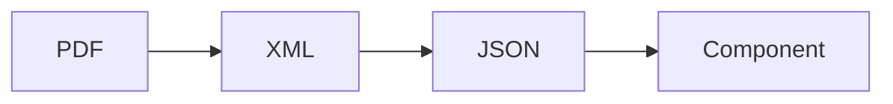

## Introduzione

Nel mio sito personale ho sempre avuto una sezione dove si potesse esaminare il mio curriculum vitae, e scaricarne una versione in formato PDF.

Le informazioni del mio curriculum erano definite all'interno di un file XML, nel formato previsto dalla [XML Résumé Library](http://xmlresume.sourceforge.net/), mediante la quale veniva poi trasformato in vari formati, fra cui HTML e PDF, per poi essere inseriti nelle pagine del sito.
Oltre al fatto che tale libreria non è più mantenuta, essa utilizza tecnologie che la rendono difficilmente integrabile all'interno dei moderni framework Web.

Inoltre, da qualche anno i miei clienti mi chiedono spesso di produrre il curriculum vitae in formato [Europass](https://europass.europa.eu), che è un formato standardizzato per i curriculum vitae in Europa.
&Egrave; quindi diventato sempre più noioso e complicato mantenere allineati il mio curriculum vite Eurpass e quello del mio sito.

Con il rifacimento del mio sito utilizzando [Astro](https://astro.build/), ho deciso di esplorare la possibilità di produrre la pagina del curriculum vitae utilizzando direttamente i dati di Europass.

## Il formato Europass

Il formato Europass è un formato standardizzato per i curriculum vitae in Europa, che permette di descrivere le competenze, le qualifiche e le esperienze professionali in modo uniforme e comprensibile in tutti i paesi dell'Unione Europea.

All'interno del sito di [Europass](https://europass.europa.eu) è possibile creare un profilo, inserire le informazioni del proprio curriculum vitae, e scaricare il curriculum in formato PDF.

Per un certo periodo sembra sia stato possibile scaricare i dati del proprio curriculum in formato XML, ed utilizzare dei servizi web per accedere ad esso, ma ora questo sembra non essere più possibile (se qualcuno sa come fare, mi faccia sapere!).

Ciò che è attualmente possibile fare è scaricare il curriculum in formato PDF (eventualmente condividendo un link accessibile pubblicamente). All'interno del PDF è presente, come attachment (sì, il formato PDF supporta gli attachment), il curriculum in formato XML, da cui probabilmente esso è stato generato.

Se sei interessato a come è strutturato il curriculum in formato XML, [in questo documento](https://europass.europa.eu/system/files/2020-08/ECV_Schema_Documentation_v3.0.0_20200602.pdf) è presente la documentazione dello schema XML.

## Il processo di estrazione dei dati

Dopo aver scaricato il curriculum in formato PDF (eventualmente è possibile automatizzarne anche il download, ma io non l'ho fatto), è necessario estrarre il file XML contenuto all'interno.
Dato che il formato XML è decisamente scomodo da utilizzare all'interno di un framwork Javascript, ho deciso di convertirlo in formato JSON.

Il processo di estrazione dei dati è il seguente:



### Estrazione del file XML

Per estrarre il file XML contenuto all'interno del PDF, ho utilizzato il comando `pdfdetach` del pacchetto [poppler-utils](https://github.com/elswork/poppler-utils):

```bash
pdfdetach -savefile attachment.xml -o cv.xml cv.pdf
```

Per installare `poppler-utils` su Debian e derivate:

```bash
sudo apt-get install poppler-utils
```

Dovrebbero esserci pacchetti equivalenti per altre distribuzioni Linux.

Se non usate Linux, potete usare poppler-utils tramite Docker:

```bash
docker run -it --rm -v $(pwd):/data elswork/poppler-utils \
pdfdetach -savefile attachment.xml -o cv.xml cv.pdf
```

### Conversione in formato JSON

Ci sono vari modi per convertire un file XML in formato JSON, ciascuno dei quali può produrre risultati differenti. Io ho utilizzato il pacchetto [convert-xml-tojson](https://github.com/Zamiell/convert-xml-to-json), che, pur essendo molto semplice e poco flessibile, svolge il suo compito egregiamente.

```bash
npx convert-xml-to-json cv.xml cv.json
```

Il risultato è un file JSON che contiene tutti i dati del curriculum in formato Europass, convertendo ogni tag XML in un campo JSON.

Ad esempio, a partire da questo frammento di XML:

```xml title="cv.xml" collapse={4-9, 13-24}
<EmployerHistory>
    <hr:OrganizationName>D2P Solution S.R.L.</hr:OrganizationName>
    <OrganizationContact>
        <Communication>
            <Address>
                <oa:CityName>Roma</oa:CityName>
                <CountryCode>it</CountryCode>
            </Address>
        </Communication>
    </OrganizationContact>
    <hr:IndustryCode>P</hr:IndustryCode>
    <PositionHistory>
        <PositionTitle typeCode="URI" languageID="http://data.europa.eu/esco/occupation/81f8d141-3f67-4fb0-a349-db0147ef7b3a">
            Insegnante nei corsi di qualificazione professionale
        </PositionTitle>
        <eures:EmploymentPeriod>
            <eures:StartDate>
                <hr:FormattedDateTime>2023-01</hr:FormattedDateTime>
            </eures:StartDate>
            <hr:CurrentIndicator>true</hr:CurrentIndicator>
        </eures:EmploymentPeriod>
        <oa:Description>&lt;p&gt;Formazione sui seguenti argomenti: SQL, Java, JDBC, JPA/Hibernate, Java EE, Servlets, Spring Framework, Spring MVC, Maven, HTML, CSS, JavaScript, Angular, Git, Test Driven Development, Microservizi.&lt;/p&gt;</oa:Description>
        <City>Roma</City>
        <Country>it</Country>
    </PositionHistory>
</EmployerHistory>
```

si ottiene questo JSON:

```json title="cv.json" collapse={7-18, 22-49}
"EmploymentHistory": [
    {
        "EmployerHistory": [
        {
            "hr:OrganizationName": ["D2P Solution S.R.L."],
            "OrganizationContact": [
                {
                    "Communication": [
                        {
                            "Address": [
                                {
                                    "oa:CityName": ["Roma"],
                                    "CountryCode": ["it"]
                                }
                            ]
                        }
                    ]
                }
            ],
            "hr:IndustryCode": ["P"],
            "PositionHistory": [
                {
                    "PositionTitle": [
                        {
                            "_": "Insegnante nei corsi di qualificazione professionale",
                            "$": {
                                "typeCode": "URI",
                                "languageID": "http://data.europa.eu/esco/occupation/81f8d141-3f67-4fb0-a349-db0147ef7b3a"
                            }
                        }
                    ],
                    "eures:EmploymentPeriod": [
                        {
                            "eures:StartDate": [
                                {
                                    "hr:FormattedDateTime": [
                                        "2023-01"
                                    ]
                                }
                            ],
                            "hr:CurrentIndicator": ["true"]
                        }
                    ],
                    "oa:Description": [
                        "<p>Formazione sui seguenti argomenti: SQL, Java, JDBC, JPA/Hibernate, Java EE, Servlets, Spring Framework, Spring MVC, Maven, HTML, CSS, JavaScript, Angular, Git, Test Driven Development, Microservizi.</p>"
                    ],
                    "City": ["Roma"],
                    "Country": ["it"]
                }
            ]
        }
        ]
    }
]
```

## Automazione del processo di estrazione dei dati

Pur essendo delle operazioni tutto sommato semplici da eseguire anche manualmente, ho deciso di automatizzarlo definendo degli script NPM, che potessero essere lanciati più facilmente, ed eventualmente anche automaticamente durante il build del sito.

Purtroppo non esiste un pacchetto NPM che fornisca un comando per estrarre allegati da file PDF. Ho dovuto quindi aggiungere uno script Typescript, che, utilizzando la libreria [pdf-lib](https://pdf-lib.js.org/), eseguisse tale lavoro.

Ho quindi aggiunto al progetto tale libreria:

```bash
pnpm add -D pdf-lib
```

Usando come punto di partenza quanto descritto [qui](https://github.com/Hopding/pdf-lib/issues/534), il risultato è stato il seguente:

```typescript title="extract-pdf-attachment.ts" collapse={4-11, 15-31, 35-44}
import fs from "fs";
import {
    PDFDocument,
    PDFName,
    PDFDict,
    PDFArray,
    PDFHexString,
    PDFString,
    PDFStream,
    decodePDFRawStream,
    PDFRawStream,
} from "pdf-lib";

const extractRawAttachments = (pdfDoc: PDFDocument) => {
    if (!pdfDoc.catalog.has(PDFName.of("Names"))) return [];
    const Names = pdfDoc.catalog.lookup(PDFName.of("Names"), PDFDict);

    if (!Names.has(PDFName.of("EmbeddedFiles"))) return [];
    const EmbeddedFiles = Names.lookup(PDFName.of("EmbeddedFiles"), PDFDict);

    if (!EmbeddedFiles.has(PDFName.of("Names"))) return [];
    const EFNames = EmbeddedFiles.lookup(PDFName.of("Names"), PDFArray);

    const rawAttachments = [];
    for (let idx = 0, len = EFNames.size(); idx < len; idx += 2) {
        const fileName = EFNames.lookup(idx) as PDFHexString | PDFString;
        const fileSpec = EFNames.lookup(idx + 1, PDFDict);
        rawAttachments.push({ fileName, fileSpec });
    }

    return rawAttachments;
};

const extractAttachments = (pdfDoc: PDFDocument) => {
    const rawAttachments = extractRawAttachments(pdfDoc);
    return rawAttachments.map(({ fileName, fileSpec }) => {
        const stream = fileSpec
            .lookup(PDFName.of("EF"), PDFDict)
            .lookup(PDFName.of("F"), PDFStream) as PDFRawStream;
        return {
            name: fileName.decodeText(),
            data: decodePDFRawStream(stream).decode(),
        };
    });
};

(async () => {
    const args = process.argv.slice(2);
    if (args.length !== 3) {
        console.log(
            "Usage: tsx extract-pdf-attachment.ts <pdfFile> <attachmentName> <destinationFile>"
        );
        process.exit(1);
    }

    const pdfFile = args[0];
    const attachmentName = args[1];
    const destinationFile = args[2];

    const pdf = fs.readFileSync(pdfFile);
    const pdfDoc = await PDFDocument.load(pdf.toString("base64"));

    const attachments = extractAttachments(pdfDoc);

    const attachment = attachments.find(
        (attachment) => attachment.name === attachmentName
    )!;
    fs.writeFileSync(destinationFile, attachment.data);
    console.log(`Attachment file written to ${destinationFile}`);
})();
```

&Egrave; quindi ora possibile estrarre l'allegato XML da un file PDF:

```bash
pnpx tsx extract-pdf-attachment.ts cv.pdf attachment.xml cv.xml
```

Innanzitutto occorre assicurarsi di avere tutte le dipendenze necessarie:

```bash
pnpm add -D tsx convert-xml-to-json pdf-lib
```

Ora è quindi possibile usarlo definire degli script in `package.json` che automatizzino il tutto.

```json title="package.json" collapse={1-4}
"scripts": {
    "dev": "astro dev",
    "build": "astro build",
    "preview": "astro preview",
    "astro": "astro",
    "extract-cv:pdf-to-xml": "tsx scripts/extract-pdf-attachment.ts public/docs/cv.pdf attachment.xml src/libs/cv/cv.xml",
    "extract-cv:xml-to-json": "convert-xml-to-json src/libs/cv/cv.xml src/libs/cv/cv.json",
    "extract-cv": "npm run extract-cv:pdf-to-xml && npm run extract-cv:xml-to-json"
},
```

L'intero processo di estrazione dei dati può quindi essere eseguito con un solo comando:

```bash
pnpm run extract-cv
```

## Creazione del componente

Una volta ottenuto il file JSON contenente i dati del curriculum, è possibile utilizzarlo all'interno di un componente o di una pagina Astro per visualizzarli.

Ad esempio, questo è quello che io utilizzo attualmente per la pagina del curriculum nel mio sito:

```js title="src/pages/cv.astro" collapse={2-5, 7-69, 72-83, 96-121, 123-137}
---
import Layout from '@layouts/Layout.astro';

import * as m from "@paraglide/messages"

import cv  from '@libs/cv/cv.json'
import { Icon } from 'astro-icon/components';

const title = 'Curriculum Vitae';
const description = 'Il mio curriculum vitae';

const employmentPeriod = (period: any) => {
    if (period) {
        const startDate = period['eures:StartDate']?.[0]['hr:FormattedDateTime'][0];
        const endDate = period['eures:EndDate']?.[0]['hr:FormattedDateTime'][0]
        if (period['hr:CurrentIndicator']?.[0] === 'true') {
            return `${formatDate(startDate)} - <span class="italic">${m.now()}</span>`;
        }
        return `${formatDate(startDate)} - ${formatDate(endDate)}`;
    }
    return "";
}

const educationPeriod = (period: any) => {
    if (period) {
        const startDate = period?.StartDate?.[0]['hr:FormattedDateTime'];
        const endDate = period?.EndDate?.[0]['hr:FormattedDateTime']
        if (startDate && endDate) {
            return `${startDate} - ${endDate}`;
        }
        if (startDate) {
            return `${startDate}`;
        }
        if (endDate) {
            return `${endDate}`;
        }
    }
    return "";
}

const finalGrade = (degree: any) => {
    if (degree?.FinalGrade) {
        return `${m.finalGrade()}: ${degree.FinalGrade[0]['hr:ScoreText']}`;
    }
    return "";
}

const educationLink = (education: any) => {
    if (education?.Link) {
        return education?.Link?.[0];
    }
    return undefined;
}

const formatDate = (date: string) => {
    const parts = date.split('-');
    if (parts.length === 1) {
        return date;
    }
    let options: any = { year: 'numeric' };
    if (parts.length === 2) {
        options = { year: 'numeric', month: 'long' };
    }
    if (parts.length === 3) {
        options = { year: 'numeric', month: 'long', day: 'numeric' };
    }
    const d = new Date(date);    
    return d.toLocaleString(Astro.currentLocale, options);
}
---
<Layout title={title} description={description}>
    <div class="flex flex-wrap justify-between items-center">
        <h1>{m.curriculumVitae()}</h1>
        <div class="flex flex-col items-end">
            <a href="/docs/cv.pdf" class="flex flex-nowrap items-center" target="_blank" rel="noopener noreferrer"><Icon name="vscode-icons:file-type-pdf2" size={32}/><span>{m.download()}</span></a>
            <div>{m.lastUpdate()}: {formatDate(cv.Candidate.RenderingInformation[0].ClosingStatement[0].Date[0]['hr:FormattedDateTime'][0])}</div>
        </div>
    </div>
    <div class="flex justify-between sticky top-0 bg-gray-200/90 dark:bg-gray-800/90 p-2">
        <a href="#job-experience">{m.jobExperience()}</a>
        <a href="#education">{m.education()}</a>
        <a href="#publications">{m.publications()}</a>
    </div>
    <h2 id="job-experience" class="scroll-mt-10">{m.jobExperience()}</h2>
    <div class="flex flex-wrap items-stretch">
        {cv.Candidate.CandidateProfile[0].EmploymentHistory[0].EmployerHistory.map((job, index) => (
            <div class="w-full md:w-1/3 my-2">
                <div class="h-full border border-gray-300 rounded-md p-2 mx-2">
                    <div class="period" set:html={employmentPeriod(job.PositionHistory[0]['eures:EmploymentPeriod']?.[0])}></div>
                    <h3>{job.PositionHistory[0].PositionTitle[0]['_']}<span class="organization"><br/>{job['hr:OrganizationName']}</span></h3>
                    <div set:html={job.PositionHistory[0]['oa:Description']} class="text-justify"></div>
                </div>
            </div>
        ))}
    </div>
    <h2 id="education" class="scroll-mt-10">{m.education()}</h2>
    <div class="flex flex-wrap items-stretch">
        {cv.Candidate.CandidateProfile[0].EducationHistory[0].EducationOrganizationAttendance.map((education, index) => (
            <div class="w-full md:w-1/3 my-2">
                <div class="h-full border border-gray-300 rounded-md p-2 mx-2">
                    <div class="period" set:html={educationPeriod(education.AttendancePeriod[0])}></div>
                    <h3>{education.EducationDegree[0]['hr:DegreeName']}<span class="organization"><br/>{education['hr:OrganizationName'][0]}</span></h3>
                    <div set:html={finalGrade(education.EducationDegree[0])}></div>
                    {educationLink(education) ? <div><a href={educationLink(education)} target="_blank" rel="noopener noreferrer">
                        {m.moreInfos()}</a></div> : <div></div>}
                </div>
            </div>
        ))}
    </div>
    <h2 id="publications" class="scroll-mt-10">{m.publications()}</h2>
    <div class="flex flex-wrap items-stretch">
        {cv.Candidate.CandidateProfile[0].PublicationHistory[0].Publication.map((publication, index) => (
            <div class="w-full md:w-1/3 my-2">
                <div class="h-full border border-gray-300 rounded-md p-2 mx-2">
                    <div class="period">{publication.Year[0]}</div>
                    <h3>{publication.Title[0]}</h3>
                    <div set:html={publication['hr:FormattedPublicationDescription']}></div>
                </div>
            </div>
        ))}
    </div>
</Layout>
<style>
    @reference "../styles/global.css";
    h2 {
        @apply text-3xl font-bold border-b-4 border-gray-200 dark:border-gray-600 mt-4;        
    }
    h3 {
        @apply text-xl font-bold mb-2 border-b-2 border-gray-200 dark:border-gray-600;
    }
    h3 > span.organization {
        @apply font-normal italic;
    }
    div.period {
        @apply text-sm;
    }
</style>
```

Il risultato lo potete vedere nella [pagina del curriculum](https://www.benfante.com/cv) del mio sito.
