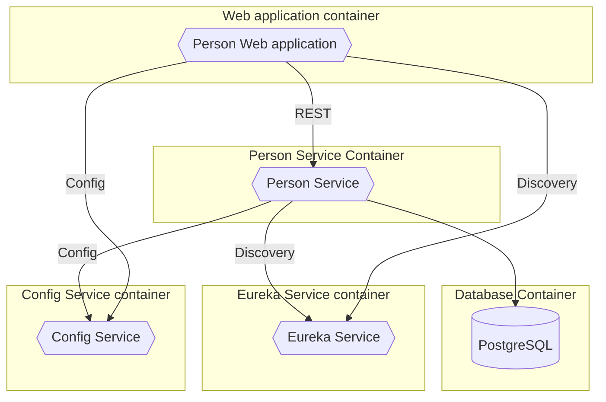

## Introduzione

In questo articolo, esamineremo un'applicazione d'esempio che ho sviluppato ed uso per i miei corsi sull'architettura a Microservizi. L'applicazione è un semplice sistema di gestione di dati di persone, che consente di aggiungere, modificare e visualizzare le informazioni relative a ciascuna persona. In futuro potrebbe essere estesa per includere funzionalità più complesse, come la gestione di relazioni tra persone, lo scambio di messaggi tra persone, o l'integrazione con altri sistemi.

L'applicazione è composta da due microservizi principali:

- **Person Service**: gestisce le informazioni relative alle persone. Espone un'API REST per creare, leggere, aggiornare ed eliminare le informazioni delle persone. Utilizza il framework Spring Boot e comunica con un database PostgreSQL per memorizzare i dati delle persone.
- **Person Web application**: è un'applicazione web che consente di visualizzare e gestire le informazioni delle persone. Utilizza il framework Spring Boot per la creazione dell'interfaccia utente e comunica con il *Person Service* tramite chiamate REST, usando [Spring Cloud Circuit Breaker](https://spring.io/projects/spring-cloud-circuitbreaker) (con Resilience4J) per gestire eventuali errori di comunicazione.


A questi si aggiungono altri servizi infrastrutturali:

- **Eureka Service**: è un servizio di discovery che consente ai microservizi di registrarsi e scoprire altri servizi.
- **Config Service**: gestisce la configurazione centralizzata dei microservizi.

<div class="max-w-3/4 m-auto">



</div>

## Eseguire l'applicazione

Il codice sorgente dell'applicazione è disponibile su [GitHub](https://github.com/benfante-teaching/microservices-demo).

Per farne il build è necessario aver installato:

- Java 24+: ad esempio, da [Adoptium](https://adoptium.net/temurin/releases/?version=24), ma qualunque distribuzione devrebbe andare bene. Io di solito uso [Liberica](https://bell-sw.com/pages/downloads/#jdk-24)
- [Docker](https://www.docker.com): necessario anche per eseguire i test, che si basano su [Testcontainers](https://testcontainers.com)

Quindi, supponendo di avere quanto sopra già installato e pronto, i seguenti passaggi sono sufficienti per eseguire l'applicazione ([git]( https://git-scm.com) lo evete già, vero? 😉):

1. Clonare il repository:

    ```bash
    git clone https://github.com/benfante-teaching/microservices-demo.git
    ```

2. Entrare nella cartella del progetto:

    ```bash
    cd microservices-demo
    ```

3. Eseguire il build dell'applicazione e delle relative docker image:

    ```bash
    ./mvnw clean verify
    ```

4. Eseguire l'applicazione con Docker Compose:

    ```bash
    docker compose up
    ```

5. Aprire il browser e navigare su [http://localhost:8082](http://localhost:8082) per accedere all'applicazione web.

Altri elementi disponibili sono (ricorda, è un ambiente per insegnare: in un ambiente di produzione non sarebbero esposti, o sarebbero almeno protetti adeguatamente!):

- **Swagger UI** per i servizi di People Service: [http://localhost:8081/swagger-ui.html](http://localhost:8081/swagger-ui.html)
- **Eureka Service Dashboard**: [http://localhost:8761](http://localhost:8761)
- **H2 Console** per accedere al database PostgreSQL: [http://localhost:8081/h2-console](http://localhost:8081/h2-console). I parametri sono i seguenti:
  - Saved Settings: `Generic PostgreSQL`
  - Driver Class: `org.postgresql.Driver`
  - JDBC URL: `jdbc:postgresql://people-postgres/people`
  - User Name: `people`
  - Password: `people`
- **Database PostgreSQL**: potete accedervi direttamente usando [pgAdmin](https://www.pgadmin.org) o un altro client SQL (ad esempio, [DBeaver](https://dbeaver.io)). Le credenziali sono le seguenti:
  - Host: `localhost`
  - Porta: `54321`
  - Database: `people`
  - Utente: `people`
  - Password: `people`

## Sviluppare i singoli microservizi

I progetti sono organizzati in moduli Maven, quindi potete sviluppare i singoli microservizi come singoli progetti Maven normali.

Per esempio, per sviluppare il *Person Service*, potete entrare nella cartella `person-service` e usare i comandi Maven standard:

```bash
cd person-service
./mvnw clean verify
```

Per eseguire il servizio durante lo sviluppo, potete usare:

```bash
./mvnw spring-boot:run
```

In questo modo, il servizio verrà eseguito sulla porta 8080, e tutte le sue dipendenze (People Web Application, Config Server, Eureka Server, ecc.) verranno eseguite automaticamente all'interno di container Docker, grazie al supporto per Docker Compose di Spring Boot.

## Conclusione

In questo articolo abbiamo esaminato un'applicazione d'esempio che illustra l'architettura a Microservizi. Abbiamo visto come è strutturata l'applicazione, quali sono i suoi componenti principali e come eseguirla in locale. Abbiamo anche visto come sviluppare i singoli microservizi utilizzando Maven e Spring Boot.

Spero che questo esempio possa esservi utile per comprendere meglio l'architettura a Microservizi e come implementarla in un'applicazione reale. Se avete domande o commenti, non esitate a contattarmi!

In futuro, l'applicazione verrà estesa per includere esempi su altri argomenti che intendo approfondire nei miei prossimi corsi, come ad esempio:

- **Spring Cloud Gateway**: per gestire le chiamate tra i microservizi e l'applicazione web
- **Spring Cloud Stream**: per gestire la comunicazione tra i microservizi tramite eventi
- Deployment su Kubernetes
- Autenticazione e autorizzazione con OAuth2
- Monitoraggio e tracciamento delle chiamate tra i microservizi
- ...altro? Fatemi sapere nei commenti!

## Risorse utili

- [Project repository](https://github.com/benfante-teaching/microservices-demo)
- [Spring Boot](https://spring.io/projects/spring-boot)
- [Spring Cloud](https://spring.io/projects/spring-cloud)
- [Spring Cloud Circuit Breaker](https://spring.io/projects/spring-cloud-circuitbreaker)
- [Spring Cloud Config](https://spring.io/projects/spring-cloud-config)
- [Spring Cloud Commons](https://docs.spring.io/spring-cloud-commons/reference/)
- [Spring Boot Docker Compose Support](https://docs.spring.io/spring-boot/reference/features/dev-services.html#features.dev-services.docker-compose)
- [Spring Boot Database Initialization](https://docs.spring.io/spring-boot/how-to/data-initialization.html)
- [Testcontainers](https://testcontainers.com)
